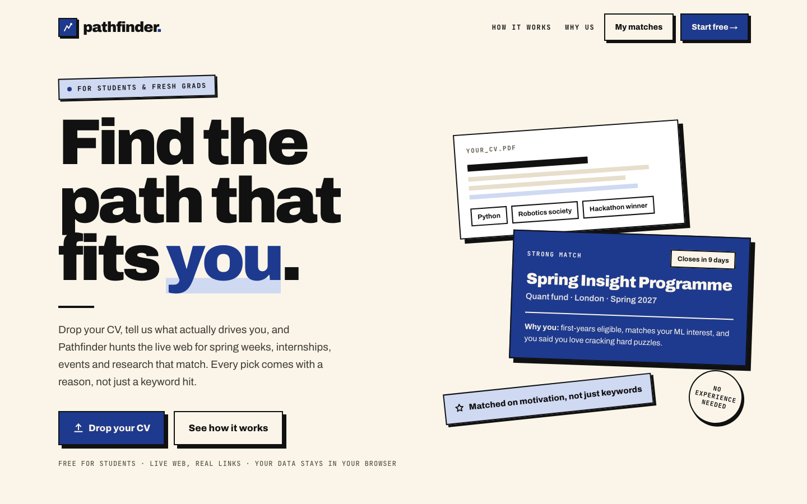

# pathfinder.

**Find the path that fits you.** Pathfinder turns a student's CV and motivations into a live, ranked map of early-careers opportunities: internships, spring weeks, work experience, residencies, fellowships and more. It also finds the events, courses, research schemes and people that help you get there.

Every result comes from a real page that [TinyFish](https://tinyfish.ai) found and read on the live web, and every one links back to its source.

**Live demo:** [pathfinder-pi-olive.vercel.app](https://pathfinder-pi-olive.vercel.app)

Built at the TinyFish × UCL AI Society Build Night, 5 October 2026.



## Why

Job boards show you everything, and most students don't have a careers network to tell them what's worth applying for. Pathfinder starts from you: your degree, what drives you, and where you want to aim. It then hunts the open web for opportunities that fit, and explains why each one does.

It works for **every career path**, not just tech and finance. An art history student gets museum internships, curatorial programmes and publishing schemes. A law student gets vacation schemes, and an engineer gets placements.

## How it works

1. **Onboarding (2 minutes).**
   - Drop your CV (PDF) and add the basics.
   - Pick what gets you out of bed ("Building things", "Public good", "Money, honestly"…).
   - Claude suggests career paths that fit your profile, each with a reason. You can keep them, drop them, or pick from 53 paths across 10 sectors.
2. **The hunt.**
   - Claude turns your profile into targeted searches written in each sector's own terms (residencies, vacation schemes, work experience, fellowships…).
   - TinyFish searches the web and reads every promising page.
   - A live loading screen shows each step and each find as it lands. The first ranked matches usually appear in about 25 seconds.
3. **Your matches.** Each opportunity shows:
   - a fit score and a plain-English **"Why you"**;
   - the deadline, front and centre;
   - a link to the real page.

   Save the ones you like, and hide the ones you don't.
4. **Everything else, loaded in parallel.** While you browse, the other tabs fill in:

| Tab | What you get |
| --- | --- |
| **Matches** | Ranked opportunities from the live web, filterable by type and searchable. |
| **Events** | Upcoming London events on Luma that match your paths. Pathfinder never registers on your behalf. |
| **Courses** | Three concrete skill gaps between you and your top matches, and real courses (with provider, cost and length checked against the course page) that close them. |
| **Research** | University research schemes, labs, archives and research roles, flagged when the page confirms they take undergraduates. |
| **People** | People worth learning from, found on public pages only (team pages, speaker lists, staff pages). No LinkedIn, no contact details. |
| **Saved** | An editable application tracker: status, priority, notes and deadlines, with CSV export/import. Hit **Watch** to have TinyFish re-check the page every day. |
| **Deadlines** | A six-month timeline of your deadlines and events, with courses scheduled to finish before your first deadline. |

## TinyFish endpoints

Pathfinder uses four TinyFish endpoints, each for a distinct job:

| Endpoint | What it does in Pathfinder |
| --- | --- |
| **Search** | Finds live opportunity pages for each generated query (UK results), plus Luma events, courses, research schemes and public "people" pages. |
| **Fetch** | Reads each page as clean markdown so Claude can extract the details. Each page is fetched on its own, so one slow site never holds up the rest. It also reads Luma calendars with `links: true` to follow their upcoming-event links. |
| **Agent** | Fallback for pages Fetch can't read: JavaScript-heavy job portals (Workday, Greenhouse, Lever…), near-empty pages or fetch errors. Up to 3 runs per search, started early so they overlap with everything else. Results found this way are marked "via TinyFish Agent". |
| **Monitor** | **Watch** on a saved opportunity creates a daily page monitor that keeps running after you close the tab. **Check now** runs it on demand and flags whether the page has changed. |

Claude only plans searches, extracts facts that are on the page, scores fit and explains it. It never invents an opportunity or guesses a deadline: a missing field is shown as "unknown" or "Deadline TBC".

## Tech stack

- **Next.js 16** (App Router) + **TypeScript** + **Tailwind CSS v4**, with **Motion** for animation.
- **TinyFish API** (Search, Fetch, Agent, Monitor), called server-side through `lib/tinyfish.ts`.
- **Claude** via the Anthropic SDK, with structured outputs (Zod schemas) for query planning, extraction, scoring and path suggestions. Defaults to `claude-opus-5-5`.
- **unpdf** for CV text extraction.
- Long-running searches stream progress to the browser as NDJSON, so the UI updates live.
- Your profile, results and tracker are stored in your browser's `localStorage`. There are no accounts and no database.

## Run it locally

You'll need Node.js 20+, a [TinyFish API key](https://agent.tinyfish.ai/api-keys) and an [Anthropic API key](https://console.anthropic.com).

```bash
git clone https://github.com/nathanlegit/pathfinder.git
cd pathfinder
cp .env.example .env.local   # then add your keys
npm install
npm run dev                  # http://localhost:3000
```

| Variable | Required | Notes |
| --- | --- | --- |
| `TINYFISH_API_KEY` | Yes | Used for Search, Fetch, Agent and Monitor. |
| `ANTHROPIC_API_KEY` | Yes | Used for every Claude call. If the account runs out of credit, searches and path suggestions fail with a visible error. |
| `ANTHROPIC_MODEL` | No | Overrides the Claude model (default `claude-opus-5-5`). |

API keys are only read on the server and never reach the browser.

**Deploying to Vercel:** import the repo, add the two keys under Project → Settings → Environment Variables, and deploy. The streaming routes set `maxDuration = 300` to leave room for slower Agent runs.

**Starting over:** your data lives in your browser. Run `localStorage.clear()` in the browser console, or use a private window, to go back through onboarding.

## Project structure

```
app/
  page.tsx                  Landing page
  onboarding/page.tsx       3-step onboarding: CV + basics, motivations, career paths
  matches/page.tsx          The app: Matches, Events, Courses, Research, People, Saved, Deadlines
  api/
    map/route.ts            Streams the main search: queries → search → fetch/agent → extract → score
    events/route.ts         Upcoming Luma events
    courses/route.ts        Skill gaps → courses
    research/route.ts       Undergraduate research opportunities
    people/route.ts         People from public pages
    paths/route.ts          Career paths suggested for a profile
    monitor/route.ts        Create / check / delete TinyFish Monitors
    cv/route.ts             PDF → text
components/                 UI: LoadingScreen, ActivityFeed, MatchCard, TrackerTable, Roadmap, …
lib/
  tinyfish.ts               Server-side TinyFish wrappers (search, fetchPages, runAgent, monitors)
  llm.ts                    Claude prompts and structured-output schemas
  pipeline.ts               Main search pipeline with early results and Agent fallback
  events.ts · courses.ts · discover.ts   The other tabs' pipelines
  progress.ts               Turns pipeline steps into friendly progress events
  store.ts · tracker.ts     Browser storage, tracker, CSV import/export
```

## Principles

- **Real pages only.** Every opportunity, event, course and person links to the page TinyFish found it on.
- **Public information only.** No LinkedIn or social-network scraping, and no personal contact details.
- **Nothing on your behalf.** Pathfinder never applies or registers for you.
- **Your data stays with you.** Everything you enter is stored in your own browser.

## License

[MIT](LICENSE)
